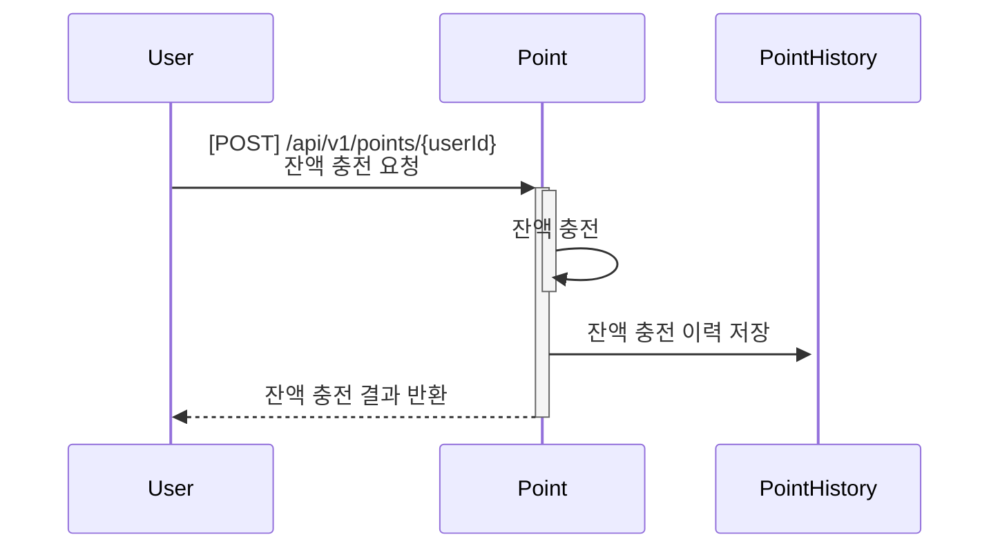
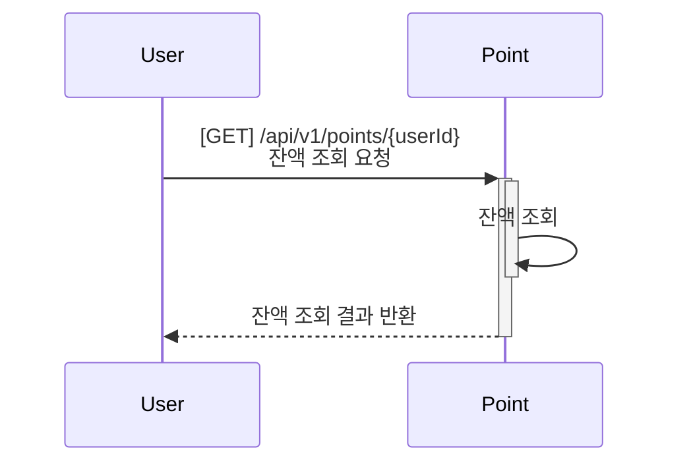
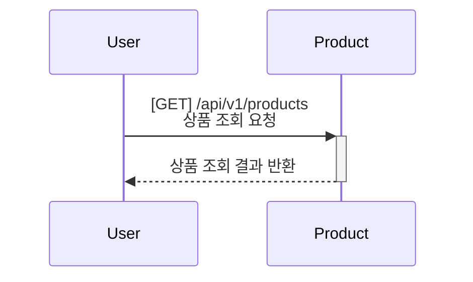
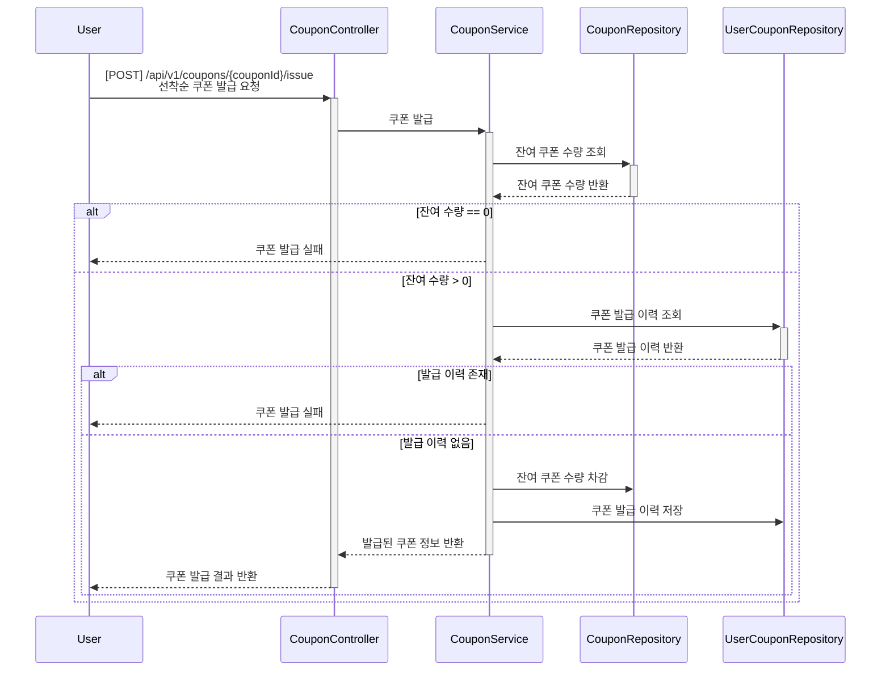
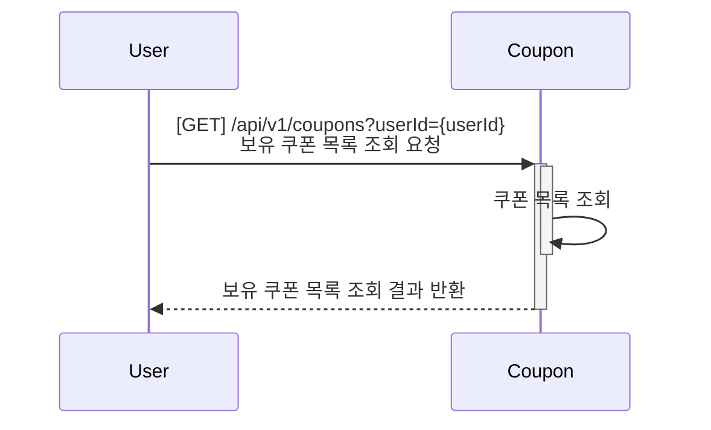
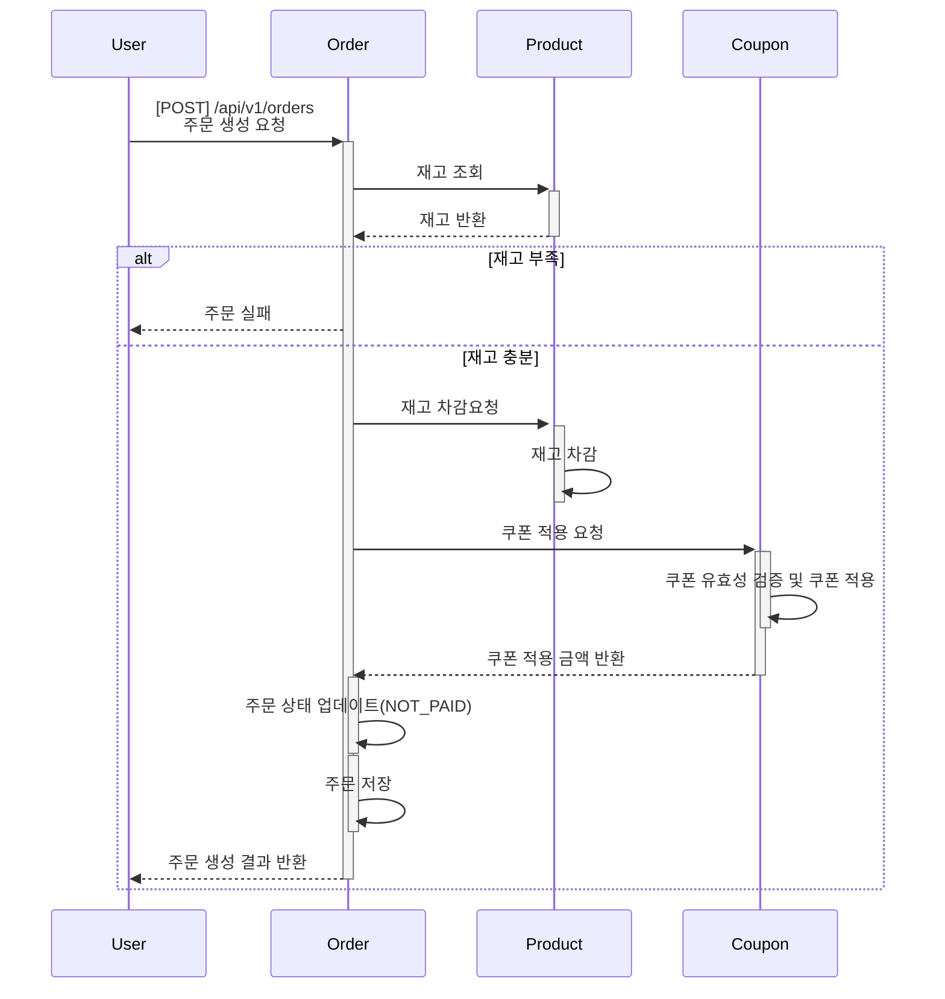
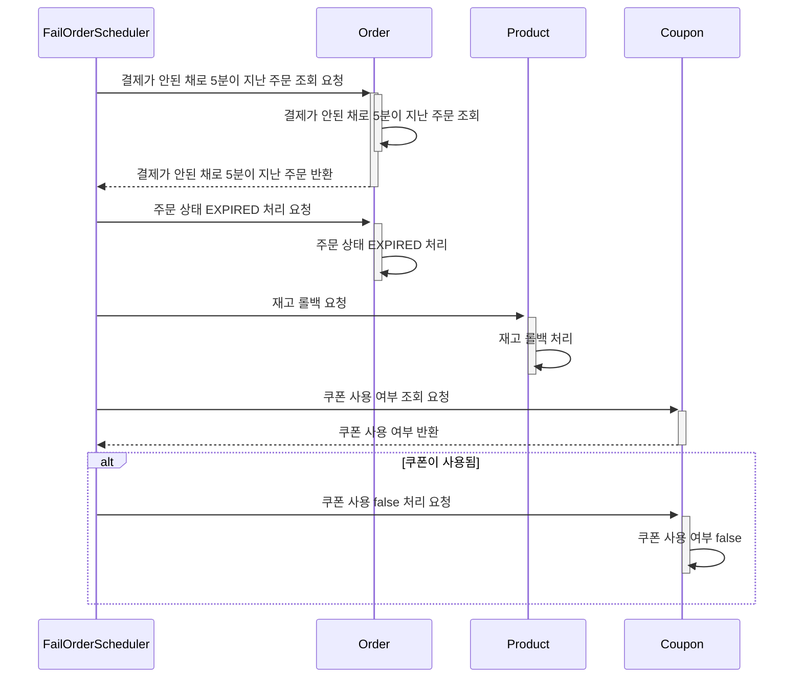
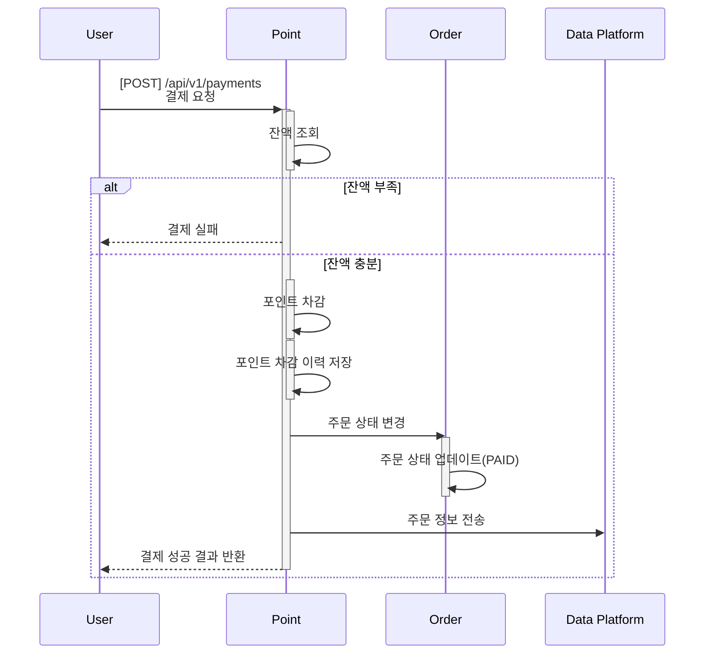
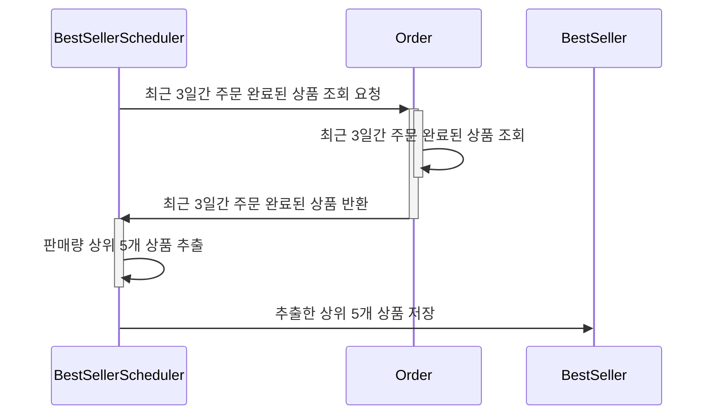
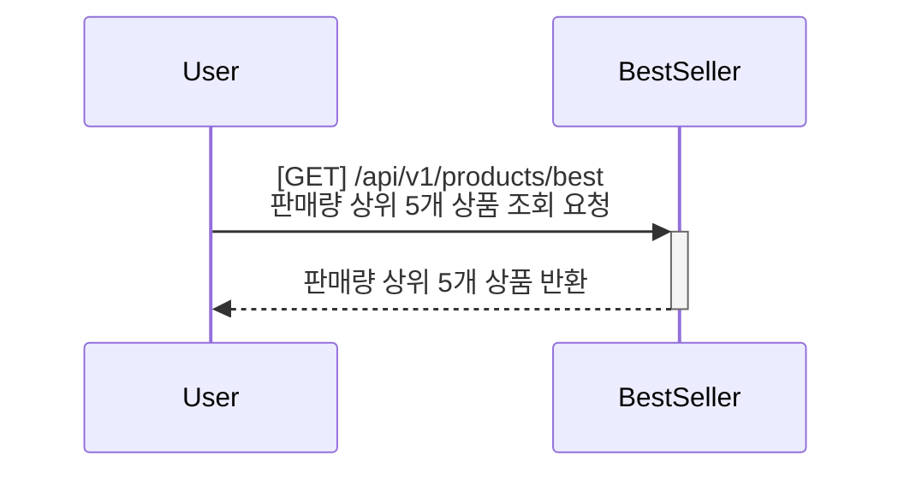

# 📦 E-커머스 서비스 씨퀀스 다이어그램

---

## 1️⃣ 잔액 충전 / 조회 기능

### 🔹 포인트 충전 

---

### 🔹 포인트 조회 

---

## 2️⃣ 상품 조회 기능

### 🔹 상품 목록 조회 

---

## 3️⃣ 선착순 쿠폰 발급 / 조회 기능

### 🔹 쿠폰 발급

---

### 🔹 보유 쿠폰 조회 

---

## 4️⃣ 주문 / 결제 기능

### 🔹 주문 생성 

---
### 🔹 주문 확인 스케줄러

---

### 🔹 결제 

---

## 5️⃣ 상위 상품 조회 기능
---
### 🔹 통계 인입 스케줄러

---

### 🔹 베스트셀러 조회

