# 📦  E-커머스 서비스 ERD

---

```mermaid
erDiagram
  user ||--o{ orders : has
  orders ||--o{ order_product : includes
  order_product }o--|| product : contains
  user ||--o{ point : owns
  point ||--o{ point_history : logs
  user ||--o{ user_coupon : receives
  user_coupon }o--|| coupon : refers

  %% product --x best_seller 관계 제거ë¨

  user {
    int id
    timestamp created_at
    timestamp updated_at
  }

  orders {
    int id
    int user_id
    int user_coupon_id
    boolean is_coupon_applied
    int total_amount
    varchar status
    timestamp created_at
    timestamp updated_at
  }

  order_product {
    int id
    int product_id
    int orders_id
    int amount
    int quantity
    timestamp created_at
    timestamp updated_at
  }

  product {
    int id
    varchar product_name
    blob description
    int price
    int stock
    timestamp created_at
    timestamp updated_at
  }

  point {
    int id
    int user_id
    int balance
    timestamp created_at
    timestamp updated_at
  }

  point_history {
    int id
    int point_id
    int amount
    int balance
    varchar type
    timestamp created_at
    timestamp updated_at
  }

  coupon {
    int id
    varchar coupon_name
    float discount_value
    varchar discount_type
    date start_date
    date end_date
    int stock
    timestamp created_at
    timestamp updated_at
  }

  user_coupon {
    int id
    int user_id
    int coupon_id
    boolean is_used
    varchar coupon_name
    date issued_at
    date expired_at
    timestamp created_at
    timestamp updated_at
  }

  best_seller {
    int id
    int product_id
    varchar product_name
    blob description
    int stock
    int sales
    timestamp created_at
    timestamp updated_at
  }
```

<!-- https://dbdiagram.io/d  
Table user {
  id integer [primary key]
  created_at timestamp [not null]
  updated_at timestamp [not null]
}
 
Table orders {
  id integer [primary key]
  user_id integer [not null] //유저ID
  user_coupon_id integer [ref: - user_coupon.id, unique] //유저쿠폰 ID - 사용 안하면 null
  is_coupon_applied boolean [not null] //쿠폰 사용 여부
  total_amount integer [not null] //총 주문금액
  status varchar [not null] //주문상태(NOT_PAID, CANCEL, PAID)
  created_at timestamp [not null]
  updated_at timestamp [not null]
}
 
Table order_product {
  id integer [primary key]
  product_id integer [not null] //상품ID
  orders_id integer [not null] //주문ID
  amount integer [not null] //주문금액
  quantity integer [not null] //주문수량
  created_at timestamp [not null]
  updated_at timestamp [not null]
}
 
Table product {
  id integer [primary key]
  product_name varchar [not null] //상품명
  description blob //상품 상세정보
  price integer [not null] // 상품 가격
  stock integer [not null] //상품 재고
  created_at timestamp [not null]
  updated_at timestamp [not null]
}
 
Table point {
  id integer [primary key]
  user_id integer [not null] //유저ID
  balance integer [not null] //잔고
  created_at timestamp [not null]
  updated_at timestamp [not null]
}
 
Table point_history {
  id integer [primary key]
  point_id integer [not null]
  amount integer [not null] //충전/사용액
  balance integer [not null] //충전/사용 당시 잔고
  type varchar [not null] //충전 or 사용
  created_at timestamp [not null]
  updated_at timestamp [not null]
}
 
Table coupon {
  id integer [primary key]
  coupon_name varchar [not null] //쿠폰 이름
  discount_value decimal [not null]// 퍼센트 or 값
  discount_type varchar [not null] // 할인 정책(정률/정액)
  start_date date [not null] //유효기간 시작일 
  end_date date [not null] //유효기간 종료일
  stock integer [not null] // 쿠폰 재고 
  created_at timestamp [not null]
  updated_at timestamp [not null]
}
 
Table user_coupon {
  id integer [primary key]
  user_id integer [not null] //유저ID 
  coupon_id integer [not null] //쿠폰ID
  is_used boolean [not null] //쿠폰 사용 여부 
  coupon_name varchar [not null] //쿠폰 이름
  issued_at date [not null] //유효기간 시작일
  expried_at date [not null] //유효기간 종료일
  created_at timestamp [not null]
  updated_at timestamp [not null]
}

Table best_seller {
  id integer [primary key]
  product_id integer [not null] //상품ID
  product_name varchar [not null] //상품명
  description blob [not null] //상품 상세정보
  stock integer [not null] //재고
  sales integer [not null] //판매량
  created_at timestamp [not null]
  updated_at timestamp [not null]
}
 
Ref product_order_item : order_product.product_id > product.id
Ref orders_order_item : order_product.orders_id > orders.id
Ref users_orders : orders.user_id > user.id
Ref point_point_history : point_history.point_id > point.id
Ref coupon_user_coupon : user_coupon.coupon_id > coupon.id
Ref user_user_coupon : user_coupon.user_id > user.id

Ref: "user"."id" - "point"."user_id"

-->

