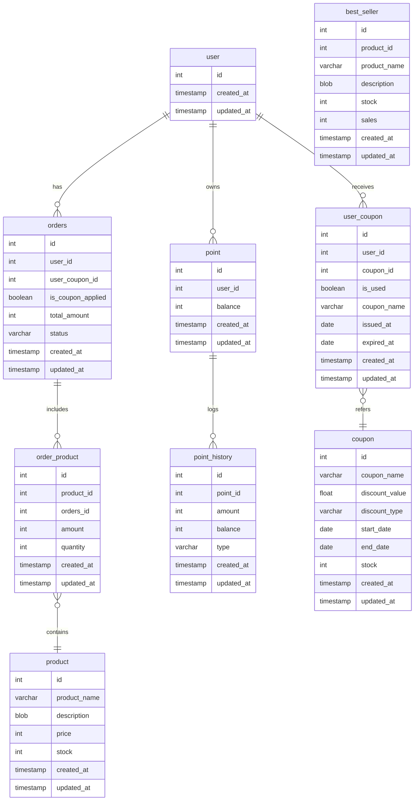

# 📦  E-커머스 서비스 ERD

---

```mermaid
erDiagram
  user ||--o{ orders : has
  orders ||--o{ order_product : includes
  order_product }o--|| product : contains
  user ||--o{ point : owns
  point ||--o{ point_history : logs
  user ||--o{ user_coupon : receives
  user_coupon }o--|| coupon : refers

  %% product --x best_seller 관계 제거됨

  user {
    int id
    timestamp created_at
    timestamp updated_at
  }

  orders {
    int id
    int user_id
    int user_coupon_id
    boolean is_coupon_applied
    int total_amount
    varchar status
    timestamp created_at
    timestamp updated_at
  }

  order_product {
    int id
    int product_id
    int orders_id
    int amount
    int quantity
    timestamp created_at
    timestamp updated_at
  }

  product {
    int id
    varchar product_name
    blob description
    int price
    int stock
    timestamp created_at
    timestamp updated_at
  }

  point {
    int id
    int user_id
    int balance
    timestamp created_at
    timestamp updated_at
  }

  point_history {
    int id
    int point_id
    int amount
    int balance
    varchar type
    timestamp created_at
    timestamp updated_at
  }

  coupon {
    int id
    varchar coupon_name
    float discount_value
    varchar discount_type
    date start_date
    date end_date
    int stock
    timestamp created_at
    timestamp updated_at
  }

  user_coupon {
    int id
    int user_id
    int coupon_id
    boolean is_used
    varchar coupon_name
    date issued_at
    date expired_at
    timestamp created_at
    timestamp updated_at
  }

  best_seller {
    int id
    int product_id
    varchar product_name
    blob description
    int stock
    int sales
    timestamp created_at
    timestamp updated_at
  }
```
